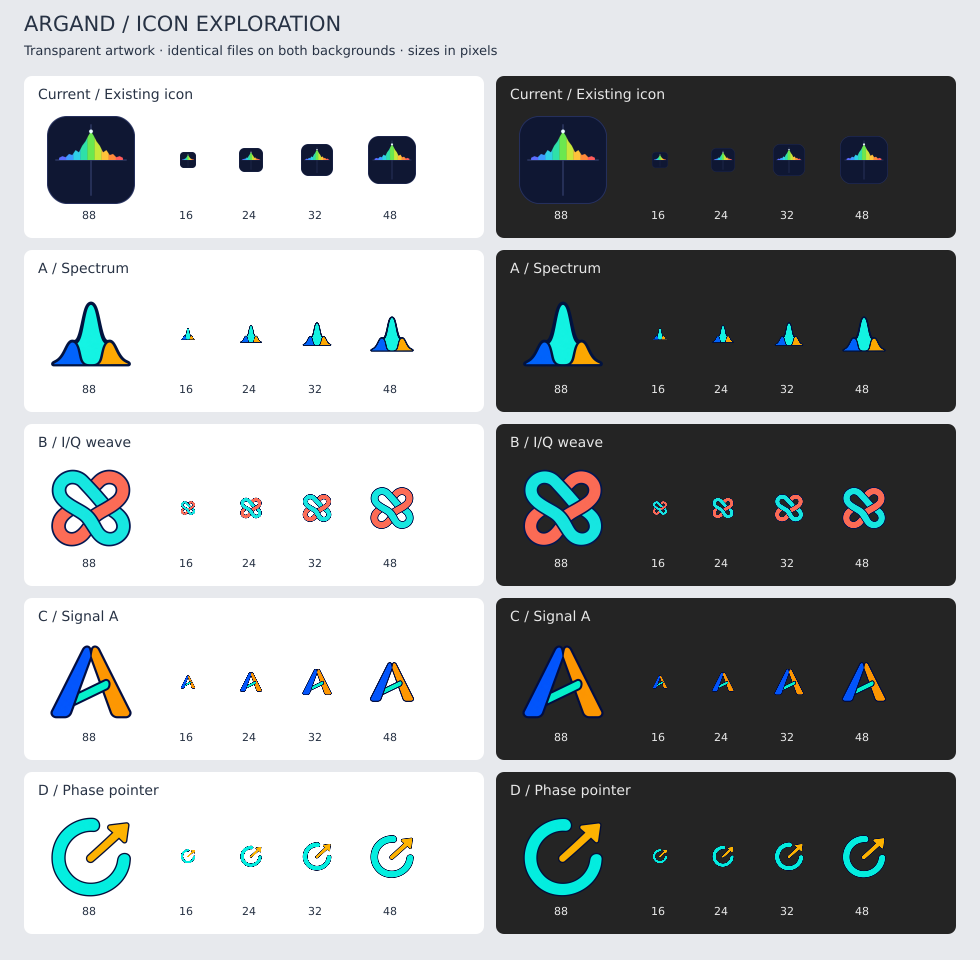
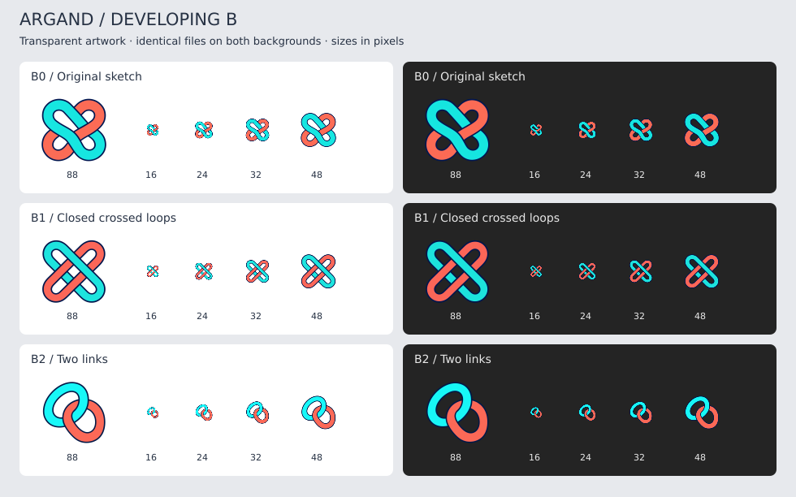

# Application icon exploration

Design work for [#41](https://github.com/o-kos/argand/issues/41), preserved for
review from another machine. **No final icon has been approved.** The application
still uses its existing artwork.

## Start here

- [Initial A–D comparison](initial-comparison.png)
- [Development of B: original, closed loops and two links](b-comparison.png)
- [Local comparison page](index.html): after cloning or downloading this directory,
  open `index.html` in a browser at 100% zoom. All references are relative and no
  network access is needed. GitHub displays HTML source rather than running it.

The sheets show 88, 16, 24, 32 and 48 pixel samples on white and dark gray.
GitHub may scale preview images to the available width; open a PNG at its native
size or use the HTML page to judge small sizes. Browser sizes are CSS pixels;
physical pixels depend on display scaling. The SVG sheets are comparison layouts
referencing the PNG sketches, **not vector source artwork for the icons**.

## Requirements and current direction

- Recognizable at 16, 24 and 32 pixels through the overall silhouette.
- Clearly visible on both light and dark backgrounds, including the Ubuntu dock.
- Prefer a transparent application icon without an enclosing background tile.
  A separate backing can still be considered for a large presentation logo.
- Keep one recognizable identity across sizes; simplify small versions if needed.

The earlier #41 baseline shift and vertical-axis tail decisions are on hold while
these requirements are explored. The owner explicitly allowed radical alternatives.

The owner selected **B, the intertwined I/Q direction**, for further development.
In B0 the coral ribbon is unintentionally open: its returning segment is missing.
B1 restores two closed loops; B2 simplifies the composition to two chain links.
Continuing B1 was proposed during the discussion; the owner has not selected
between B1 and B2 or accepted a final drawing. The dense center at 16 pixels
still needs work. The topology and crossing geometry also need deliberate
construction in the eventual vector master.

## Initial directions

| Sketch | Idea | Original image |
| --- | --- | --- |
| Current | Existing application icon, kept as a fixed comparison reference | [PNG](images/current.png) |
| A | Compact spectral crest | [PNG](images/a-spectrum.png) |
| B0 | Intertwined I/Q ribbons; missing coral return segment | [PNG](images/b0-iq-weave.png) |
| C | Signal mark built around A | [PNG](images/c-signal-a.png) |
| D | Phase pointer | [PNG](images/d-phase-pointer.png) |

## Development of B

| Sketch | Status | Original image |
| --- | --- | --- |
| B1 | Closed crossed loops; proposed continuation, not selected by the owner | [PNG](images/b1-closed-loops.png) |
| B2 | Two links; simpler construction, but more like a chain symbol | [PNG](images/b2-two-links.png) |

## Intermediate attempts

These files are retained to preserve the complete discussion, not as approved
alternatives. Painted checkerboards are actual opaque image content, not alpha.

| Attempt | Known defect | Original image |
| --- | --- | --- |
| 01 | Missing coral return segment; painted checkerboard background | [PNG](images/b-intermediate-01-checkerboard.png) |
| 02 | Transparent background restored, but coral return segment still missing | [PNG](images/b-intermediate-02-transparent.png) |
| 03 | Extra internal strips and painted checkerboard background | [PNG](images/b-intermediate-03-extra-strips.png) |

## Next discussion

Choose how to develop direction B, then refine small-size readability and agree
the final silhouette, colours, outline and crossing geometry before creating
production SVG, PNG, ICO, ICNS and monochrome assets. The sketches and comparison sheets are review material;
they have not replaced any assets under `crates/app/assets/icons/`.
