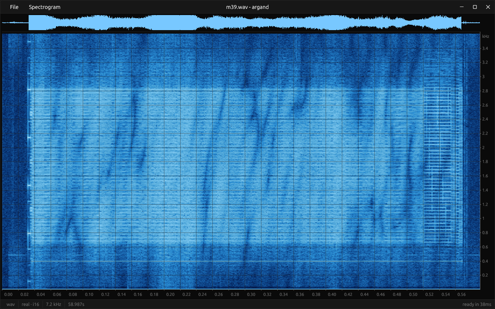
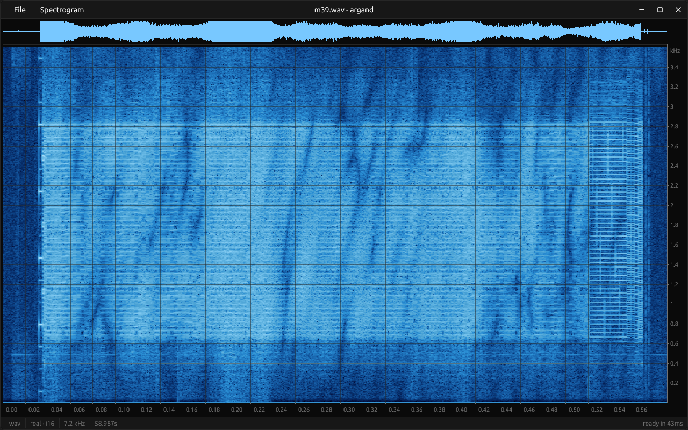
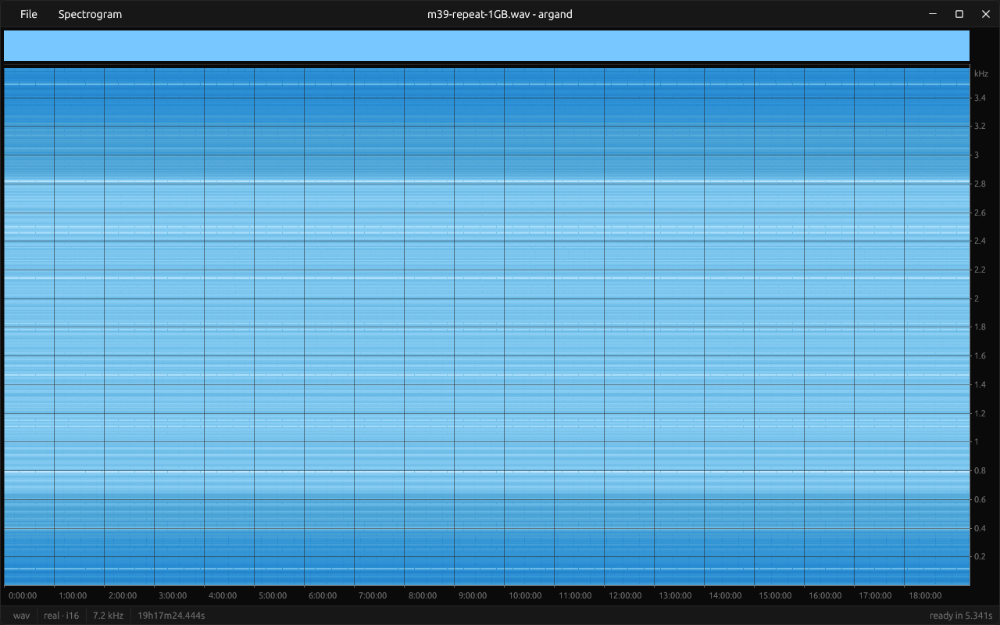
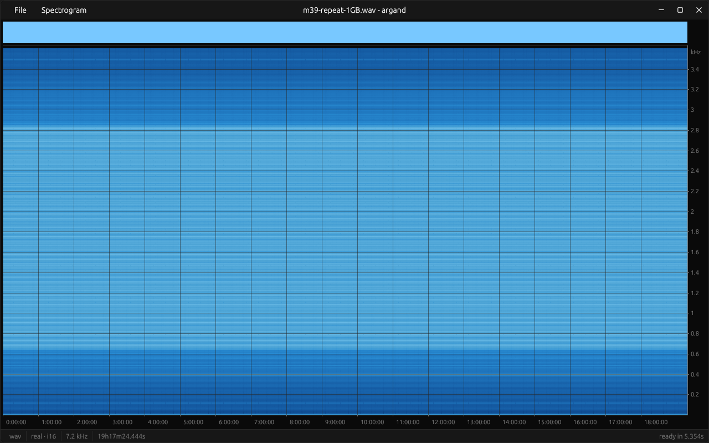

# Selectable spectrogram aggregation

Issue #69 / Draft PR #70. Linux validation on 2026-09-08.

## Behavior

Spectrogram > Aggregation selects **Peak (MAX)** or **Mean power**. MAX remains
initially selected unless the top-level `aggregation = "mean-power"` configuration
requests the other mode. Selection applies to subsequent files in the current run.
Live settings are not persisted between runs yet.

Mean power averages squared tone-calibrated FFT amplitudes within each assigned
frequency-bin group, then across all frames assigned to the time column. The
column uses an f64 sum and a frame count; dB conversion follows the average. It is
not integrated power over the displayed band, and it does not change the existing
PSD calculation or the min/max waveform. CLI `--reduce mean` retains its previous
average-in-dB semantics; the new mode is explicitly `--reduce mean-power`.

## Comparison

Both captures were opened in the current release binary in an isolated Sway
session using `/dev/dri/renderD128` (also verified in the application). The window was 1280 × 800; the spectrogram was
1236 × 662. Parameters were FFT 2048, Hann, hop 512 (75% overlap), Oceanic,
absolute 0 to -110 dBFS, no normalization/gain, eight compute workers, no affinity.
The original and repeated recordings were retained.

| Input | Samples at 7200 Hz | Duration | FFT frames | Approximate seconds per display column |
| --- | ---: | ---: | ---: | ---: |
| `tests/signals/m39.wav` | 424,703 | 58.986528 s | 826 | 0.047724 |
| `tests/signals/m39-repeat-1GB.wav` | 500,000,000 | 69,444.444444 s | 976,559 | 56.184826 |

### Original: Peak (MAX)



### Original: Mean power



### Repeated 1 GB: Peak (MAX)



### Repeated 1 GB: Mean power



Mean power reduces the overview's overall brightness and the dominance of brief
peaks. Horizontal bands remain: one column covers almost a complete repetition.
The source's short-time detail cannot survive that scale in either full-coverage
aggregate. The waveform remains a broad envelope in both modes.

As a control, `aspec` rendered the first 58.98652777777778 seconds of the repeated
file and the entire source with Mean power, identical FFT settings and a
1280 × 800 output. Their pixels differ only in the filename at the top; waveform,
spectrogram, axes and the remaining content match exactly. Both reports contain
826 frames and identical measured levels. Reproduce with:

```sh
aspec tests/signals/m39.wav --reduce mean-power -i 1280x800 -o /tmp/m39-source.png
aspec tests/signals/m39-repeat-1GB.wav --duration 58.98652777777778 \
  --reduce mean-power -i 1280x800 -o /tmp/m39-prefix.png
```

## Validation

- Analytic tests: a tone present in 1 of 100 non-overlapping rectangular frames
  gives -20 dB in Mean power and 0 dB in MAX. Frequency reduction divides by the
  assigned bin count; the legacy dB average remains -297 dB. Both real and IQ
  paths are covered, including silence and output upsampling.
- Progressive tests cover unequal column counts, preview reuse, multiple batch
  sizes and worker counts, and agreement with plain analysis. An application
  worker test replaces MAX with Mean power and rejects stale deliveries.
- Native menu checks: both checked states, selecting an already active mode,
  switching back, switching during unfinished analysis, and startup with
  `aggregation = "mean-power"`. The final image after cancellation matches the
  ordinary Mean power result exactly.
- Waveform pixels match between modes for both captures. The repeated capture's
  MAX spectrogram matches the parent branch's native capture exactly. Source
  exports under CLI MAX and legacy mean are byte-identical before and after the
  change. See [machine-readable checks](69-data/checks.json).
- `cargo fmt --all -- --check`, `cargo clippy --all-targets --locked`, and
  `cargo test --locked` passed (416 tests). The release build followed those
  checks, using `/tmp/argand-67/target`; the owner's existing
  `target/release/argand` was retained.

Single native diagnostic observations were 5.341 s for the 1 GB MAX calculation
and 5.354 s for Mean power, and 38 ms / 37 ms for the source when switching live.
These are worker-analysis timings, not input-to-display timings or a controlled
performance comparison. They do not establish equal speed or an improvement over
previous benchmarks. [Captured events](69-data/native-events.json) retain the
individual runs; startup with Mean power was checked separately.

Independent read-only review of the implementation returned no substantive
findings; no findings were rejected.

## Limits

This change still recomputes FFTs on aggregation changes and window resizing.
Mean power does not sample fewer frames. Resize caching, zoom and the broader
settings interface remain separate. Cold-cache timing, thermal repeats,
input-to-display latency and native Windows/macOS behavior were not measured in
this iteration. The initial default remains a comparison choice, not a claim that
MAX is the universally correct approximation.
